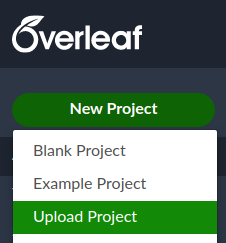
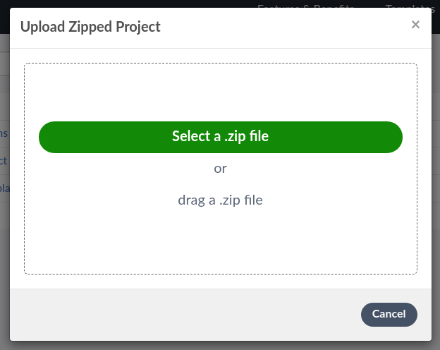
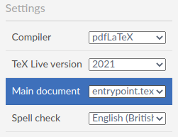

# Table of contents

- [Table of contents](#table-of-contents)
- [This package overview](#this-package-overview)
- [Installation](#installation)
  - [Requirements](#requirements)
  - [Online Setup](#online-setup)
  - [Offline Setup](#offline-setup)
- [Working Online](#working-online)
- [Working Offline](#working-offline)

# This package overview
This repository stores the research project report as latex files.

# Installation
## Requirements
- Working online:
  - [Overleaf](https://www.overleaf.com/) account.
- Working offline:
  - Text editor. Strongly recommend [Visual Studio Code](https://code.visualstudio.com/)
  - LaTeX distribution in system PATH. For example [TeX Live](https://www.tug.org/texlive/).
  - [LaTeX workshop](https://github.com/James-Yu/LaTeX-Workshop) extension for Visual studio code.

## Online Setup
Create a new Overleaf account at https://www.overleaf.com/. 
Then create a new overleaf project by upload this repository as a `.zip` file.

Setup the main document as `entrypoint.tex`

## Offline Setup
Setup your computer with required software or packages specified in [Requirements](#requirements).
Then you have three options. 

- If you have completed the online setup and have a premium Overleaf account, clone it to your computer, and open the project with Visual Studio Code.
- If you don't have a premium Overleaf I suggest [working online](#working-online).
- If you don't like working with Overleaf, simply open this repository in Visual Studeio Code. Use any prefereable version control system, [GitHub](https://github.com/) is strongly recommended.

# Working Online 
After complete the [online setup](#online-setup) you can start writing.
Overleaf will handle the compilation process and render a sample of the pdf file.

# Working Offline
Note that the main document is `entrypoint.tex`.
After complete the [offline setup](#offline-setup) you can start writing.
LaTeX workshop will build your project everytime you save the document.
The extension also give you several tools such as view latex on a VSCode tab, count words, analyse project structures, greek symbols snippet, etc.
